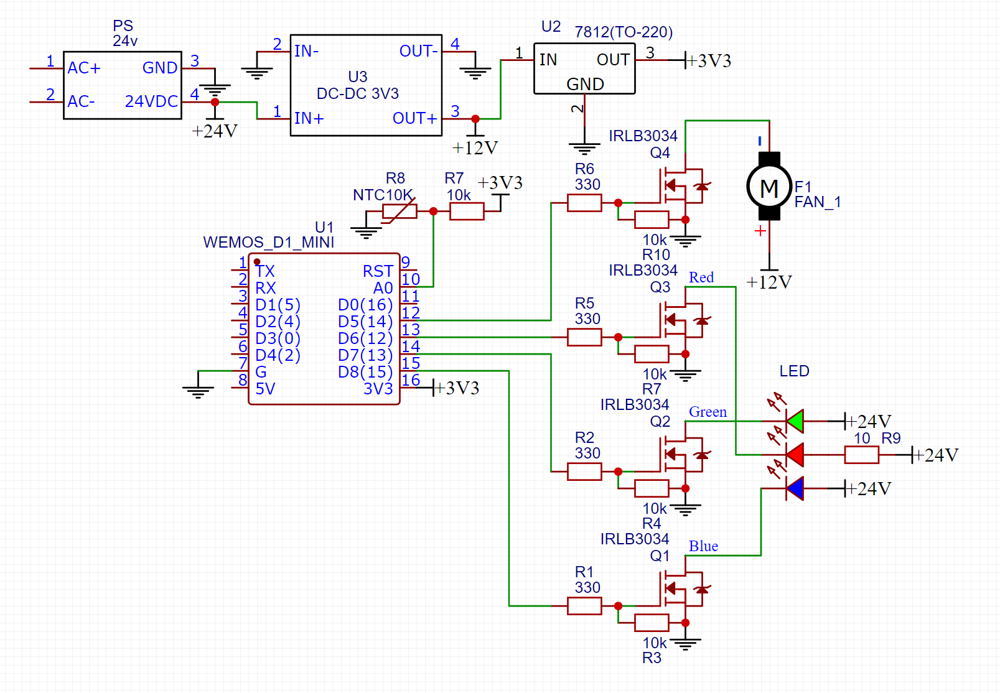

# SmartSpot

---

---

Мощный RGB-прожектор с дистанционным управлением по WiFi и встроенными эффектами. 

- **_SmartSpot_** основан на проекте **AlexGyver'a [RGBspot](https://alexgyver.ru/rgbspot/)**, но значительно переделан и доработан. 
- Внутри кода используется ядро и библиотека основного проекта — **_[SmartHomeSystem](https://github.com/MrRyabena/SmartHomeSystem/tree/v1.2.0)_**. 
- **_SmartSpot_** — первое самостоятельное устройство, интегрированное в **_SmartHomeSystem_**.
- Для дистанционного управления написано GUI-приложение, пока что на processing (может быть будет переписано на C++ (Qt)).

## Versions

v1.0.0 — <b>[current]</b> created management, API and GUI.

> This initial release of SmartSpot includes the following features: 
>
> - Developed firmware for the ESP8266 microcontroller
> - Created a GUI application using Processing for remote control
> - Established WiFi communication between the spot and the control application
> - Added support for simultaneous control of multiple SmartSpots
> - Implemented a small set of RGB effects:
>   - SetColor: Set any custom color
>   - Splash: Quick brightness changes (flashes)
>   - Shift: Pairwise color switching with shift along the color wheel
>   - ColorWheel: Smooth color change in a circular pattern
>   - Fade: Enable/disable and adjust smoothing time for color transitions
> 
> This release provides a solid foundation for the SmartSpot project, offering basic functionality and remote control capabilities.

## Содержание

- [Структура проекта](#structure)
- [Возможности](#features)
  - [Технические характеристики](#technical_specifications)
- [Техническая реализация](#technical_implementation)
  - [Общее](#common)
  - [Фотографии сборки](#photo)
  - [Компоненты и схема](#scheme)
- [Программная реализация](#software_implementation)
  - [Прошивка контроллера](#firmware)
  - [GUI-приложение](#gui_app)
    - [RGB-эффекты](#rgb_effects)

## Структура проекта

- [libraries](./libraries/) — необходимые версии библиотек, используемых в проекте.
- [photo](./photo/) — фотографии сборки и работы SmartSpot.
- [schemes](./schemes/) — схемы и чертежи.
- [src](./src/) — программный код
  - [app](./src/app/) — GIU-приложение, написанное на Processing.
  - [spot](./src/spot/) — прошивка для управляющего микроконтроллера.

## Возможности

- яркий и мощный поток света
- установка любого цвета с настройкой яркости
- установка белого цвета с настройкой температуры
- сглаживание при смене цвета (из библиотеки гайвера GRGB) и яркости (из SHSL_RGBeffects)
- RGB эффекты (в разработке)
- увеличенная частота ШИМ (не пищит, не мерцает на камеру)
- управление по WiFi
- синхронизация с другими Spot'ами
- ручное и автоматическое управление охлаждением, защита от перегрева
- бесшумная работа
- всего лишь один провод — питание от сети

### Технические характеристики

|Параметр|Значение|
|:--|:--|
|Напряжение питания      |~220 V |
|Питание матрицы         |24 V  |
|Питание охлаждения      |12 V  |
|Питание схемы управления|3.3 V |
|Мощность                |50 W  |
|Угол рассеивания        |60 °  |
|Степень защиты          |IP20  |

## Техническая реализация

### Общее

Прожектор основан на 50-ваттной светодиодной трехканальной (RGB) матрице. Излучаемый свет проходит через рассеивающую линзу, распространяясь на большую площадь. Между матрицей и линзой необходимо проложить рассеиватель из полупрозрачного пластика. Хорошо подходит зашкуренный грубой наждачной бумагой пластик от крышек консервных банок. 

Матрица сильно греется и требует активного охлаждения. Для этого лучше всего подходит массивный радиатор от старых сокетов AMD, обдуваемый вентилятором. Помимо матрицы, следует позаботиться об охлаждении стабилизаторов напряжения и балластных резисторов. 

Схема управления основана на микроконтроллере ESP8266 и полевых транзисторах. Несмотря на малый ток с пина (10 mA), транзисторы хорошо работают даже на повышенных частотах. 

Корпус устройства выполнен из канализационной муфты и двух заглушек, в которых просверлены отверстия для вентиляции. В папке _[schemes](./schemes/)_ лежат шаблоны для разметки отверстий в заглушках. 

_Более подробно о сборке устройства можно посмотреть в проекте **[AlexGyver'a](https://alexgyver.ru/rgbspot/)**._ 

<b>Фотографии сборки прожектора:</b>

### Компоненты и схема

- _Питание:_
  - **Блок питания 24V 1.5A**.
  - **LM7812/L7812** — стабилизатор напряжения 12V в корпусе TO-220 (будет греться, следует закрепить на радиаторе).
  - **DC-DC 3.3V** — фиксированный преобразователь напряжения 3.3V.
  - **Конденсатор 450-1000 uF 5.6V** — поставить рядом с микроконтроллером.
- _Микроконтроллеры:_
  - **ESP8266** — лучше всего подходит компактная плата _WeMos D1 Mini_.
- _Датчики:_
  - **Термистор 10 kOm (1 шт)** — для измерения температуры радиатора.
  - **Резистор 10 kOm (1 шт)** — вместе с термистором того же номинала образует делитель напряжения.
- _Управление нагрузкой:_
  - **IRLB3034/IRLB8743 (4 шт)** — полевые транзисторы для управления матрицей и вентилятором.
  - **Резистор 2-10 kOm (4 шт)** — для подтягивания затвора транзистора.
  - **Резистор 330 Om (4 шт)** — для ограничения тока с пина микроконтроллера.
  - **Резистор 10 Om 5-10 W** — для ограничения тока на красный канал матрицы, будет сильно греться.
- _Свет:_
  - **Светодиодная матрица RGB 24V 50W**
  - **Линза рассеивающая 60°**
- _Корпус:_
  - **Муфта канализационная 110 mm**
  - **Заглушка 110 mm (2 шт)**
 

> [!CAUTION]
> Красный канал светодиодной матрицы нельзя питать напрямую от 24V!
> Требуется подключить питание через резистор номиналом 10Om и мощностью от 5W. Резистор будет сильно греться, поэтому должен обдуваться воздухом.

## Программная реализация

### Прошивка контроллера

Прошивка основана на инструментах **_[SmartHomeSystem](https://github.com/MrRyabena/SmartHomeSystem/tree/v1.2.0)_**. Используются протоколы передачи данных и API, связь с WiFi. 

> [!IMPORTANT]
> Требуется SHScore и SHSlibrary версии <u>v2.0.0</u>, которая к моменту релиза SmartSpot еще находится в разработке. Поэтому библиотеки SmartHomeSystem необходимо установить из папки [libraries](./libraries/).

Из сторонних библиотек, помимо [core ESP8266](https://github.com/esp8266/Arduino?ysclid=m27i3k0zl6675254895), в прошивке используется разработка AlexGyver'a — [GRGB](https://github.com/GyverLibs/GRGB).

Прошивка набросана на скорую руку, в следующих версиях она будет обернута в класс. Помимо этого, будут добавлены встроенные эффекты и управление ими.

### GUI-приложение

Времени писать приложение на C++ (Qt) не было, поэтому был выбран [Processing](https://processing.org) — язык программирования, основанный на Java, с удобной встроенной графикой. 

За интерфейс отвечает библиотека CP5, работа с которой вынесена в отдельный класс. Таким образом его можно масштабировать и дублировать, для управления сразу несколькими прожекторами как синхронно, так и по отдельности. 

#### RGB-эффекты

Приложение позволяет управлять некоторыми эффектами, которые можно одновременно комбинировать между собой:

- **SetColor** — установка любого цвета.
- **Splash** — вспышки (резкое изменение яркости).
- **Shift** — переключение цветов попарно со сдвигом по цветовому кругу.
- **ColorWheel** — плавная смена цвета по кругу.
- **Fade** — включение/отключение и настройка времени сглаживания переходов между цветами

